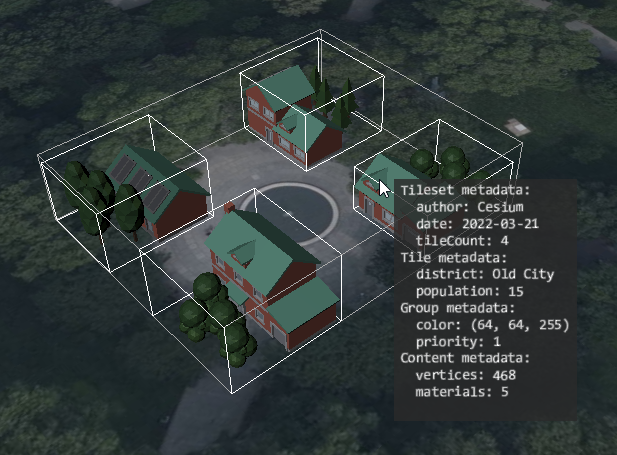

# Metadata Granularities

This sample demonstrates the use of [Metadata in 3D Tiles 1.1](https://github.com/CesiumGS/3d-tiles/blob/main/specification) on different levels of granularity. The sample consists of a tileset with 4 tiles where each tile has 5 contents, and the contents are assigned to two different groups. Metadata is assigned to the tileset, the tiles, each content, and to the groups.

## Screenshot



## Sandcastle Code

```JavaScript
const viewer = new Cesium.Viewer("cesiumContainer");

// Create the tileset, and set its model matrix to move it
// to a certain position on the globe
const tileset = viewer.scene.primitives.add(
  await Cesium.Cesium3DTileset.fromUrl(
    "http://localhost:8003/1.1/MetadataGranularities/tileset.json",
    {
      debugShowBoundingVolume: true,
    }
  )
);
tileset.modelMatrix = Cesium.Transforms.eastNorthUpToFixedFrame(
  Cesium.Cartesian3.fromDegrees(-75.152325, 39.94704, 0.0)
);

// Create an HTML element that will serve as the
// tooltip that displays the metadata information
function createTooltip() {
  const tooltip = document.createElement("div");
  viewer.container.appendChild(tooltip);
  tooltip.style.backgroundColor = "black";
  tooltip.style.position = "absolute";
  tooltip.style.left = "0";
  tooltip.style.top = "0";
  tooltip.style.padding = "14px";
  tooltip.style["pointer-events"] = "none";
  tooltip.style["block-size"] = "fit-content";
  return tooltip;
}
const tooltip = createTooltip();

// Show the given HTML content in the tooltip
// at the given screen position
function showTooltip(screenX, screenY, htmlContent) {
  tooltip.style.display = "block";
  tooltip.style.left = `${screenX}px`;
  tooltip.style.top = `${screenY}px`;
  tooltip.innerHTML = htmlContent;
}

// Create an HTML string that contains information
// about the given metadata, under the given title
function createMetadataHtml(title, metadata) {
  if (!Cesium.defined(metadata)) {
    return `(No ${title})<br>`;
  }
  const propertyKeys = metadata.getPropertyIds();
  if (!Cesium.defined(propertyKeys)) {
    return `(No properties for ${title})<br>`;
  }
  let html = `<b>${title}:</b><br>`;
  for (let i = 0; i < propertyKeys.length; i++) {
    const propertyKey = propertyKeys[i];
    const propertyValue = metadata.getProperty(propertyKey);
    html += `&nbsp;&nbsp;${propertyKey} : ${propertyValue}<br>`;
  }
  return html;
}

// Install the handler that will check the element that is
// under the mouse cursor when the mouse is moved, and
// add any metadata that it contains to the label.
const handler = new Cesium.ScreenSpaceEventHandler(viewer.scene.canvas);
handler.setInputAction(function (movement) {
  let tooltipText = "";
  const picked = viewer.scene.pick(movement.endPosition);

  const tilesetMetadata = picked?.content?.tileset?.metadata;
  tooltipText += createMetadataHtml("Tileset metadata", tilesetMetadata);

  const tileMetadata = picked?.content?.tile?.metadata;
  tooltipText += createMetadataHtml("Tile metadata", tileMetadata);

  const groupMetadata = picked?.content?.group?.metadata;
  tooltipText += createMetadataHtml("Group metadata", groupMetadata);

  const contentMetadata = picked?.content?.metadata;
  tooltipText += createMetadataHtml("Content metadata", contentMetadata);

  const screenX = movement.endPosition.x;
  const screenY = movement.endPosition.y;
  showTooltip(screenX, screenY, tooltipText);
}, Cesium.ScreenSpaceEventType.MOUSE_MOVE);

// Zoom to the tileset, with a small offset so that it
// is fully visible
const offset = new Cesium.HeadingPitchRange(
  Cesium.Math.toRadians(-45.0),
  Cesium.Math.toRadians(-45.0),
  80.0
);
viewer.zoomTo(tileset, offset);
```

## License

This sample is distributed with the [CC0](https://creativecommons.org/share-your-work/public-domain/cc0/) license. See [COPYRIGHT.md](COPYRIGHT.md) for information about the source of the glTF models.
