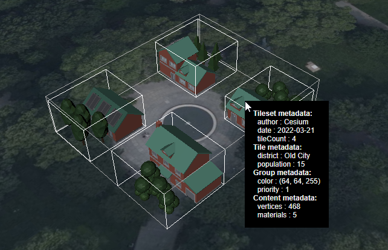

# Metadata Granularities

This sample demonstrates the use of [Metadata in 3D Tiles 1.1](https://github.com/CesiumGS/3d-tiles/blob/b7fa517e88149942bc6166b11944bac67565369e/specification/README.md#metadata) on different levels of granularity. The sample consists of a tileset with 4 tiles where each tile has 5 contents, and the contents are assigned to two different groups. Metadata is assigned to the tileset, the tiles, each content, and to the groups.

## Screenshot



## Sandcastle Code

```JavaScript
var viewer = new Cesium.Viewer('cesiumContainer');

// Create the tileset, and set its model matrix to move it
// to a certain position on the globe
var tileset = viewer.scene.primitives.add(new Cesium.Cesium3DTileset({
    url : 'http://localhost:8003/1.1/MetadataGranularities/tileset.json',
    debugShowBoundingVolume: true
}));
tileset.modelMatrix = Cesium.Transforms.eastNorthUpToFixedFrame(
  Cesium.Cartesian3.fromDegrees(-75.152325, 39.94704, 0.0));

// Create the label that will display metadata information
var labelEntity = viewer.entities.add({
  label: {
    showBackground: true,
    font: "14px monospace",
    horizontalOrigin: Cesium.HorizontalOrigin.LEFT,
    verticalOrigin: Cesium.VerticalOrigin.TOP,
    pixelOffset: new Cesium.Cartesian2(15, 0),
    // Workaround to always render label on top:
    disableDepthTestDistance: Number.POSITIVE_INFINITY
  }
});

// Adds metadata information to the label, with 
// the given title indicating which granularity
// of metadata this is. The given metadata object
// can be a TilesetMetadata, TileMetadata, 
// GroupMetadata, or ContentMetadata.
var addMetadataToLabel = function(title, metadata) {
  if (!Cesium.defined(metadata)) {
    labelEntity.label.text += "(No " + title + ")\n";
    return;
  }
  var propertyKeys = metadata.getPropertyIds();
  if (!Cesium.defined(propertyKeys)) {
    labelEntity.label.text += "(No properties for " + title + ")\n";
  }
  labelEntity.label.text += title + ":\n";
  for (var i=0; i<propertyKeys.length; i++) {
    var propertyKey = propertyKeys[i];
    var propertyValue = metadata.getProperty(propertyKey);          
    //console.log("propertyKey", propertyKey);
    //console.log("propertyValue", propertyValue);
    labelEntity.label.text += "  " + propertyKey + ": "+ propertyValue;
    labelEntity.label.text += "\n";
  }
};

// (NOTE: The way how metadata is obtained may be refactored,
// see https://github.com/CesiumGS/cesium/issues/10015 )

// Given an object that was obtained via Scene#pick, examine it 
// to see whether it contains tile metadata.
// If the object contains TileMetadata, then this metadata 
// is returned. 
// Otherwise, 'undefined' is returned.
var obtainTileMetadata = function(picked) {
  if (!Cesium.defined(picked)) {
    return undefined;
  }
  if (!Cesium.defined(picked.content)) {
    return undefined;
  }
  if (!Cesium.defined(picked.content.tile)) {
    return undefined;
  }
  if (!Cesium.defined(picked.content.tile.metadata)) {
    return undefined;
  }
  var metadata = picked.content.tile.metadata;
  var isTileMetadata = metadata instanceof Cesium.TileMetadata;
  if (!isTileMetadata) {
    return undefined;
  }
  return metadata;
};

// Given an object that was obtained via Scene#pick, examine it 
// to see whether it contains tileset metadata.
// If the object contains TilesetMetadata, then this metadata 
// is returned. 
// Otherwise, 'undefined' is returned.
var obtainTilesetMetadata = function(picked) {
  if (!Cesium.defined(picked)) {
    return undefined;
  }
  if (!Cesium.defined(picked.content)) {
    return undefined;
  }
  if (!Cesium.defined(picked.content.tileset)) {
    return undefined;
  }
  if (!Cesium.defined(picked.content.tileset.metadata)) {
    return undefined;
  }
  var metadata = picked.content.tileset.metadata.tileset;
  var isTilesetMetadata = metadata instanceof Cesium.TilesetMetadata;
  if (!isTilesetMetadata) {
    return undefined;
  }
  return metadata;
};

// Given an object that was obtained via Scene#pick, examine it 
// to see whether it contains group metadata.
// If the object contains GroupMetadata, then this metadata 
// is returned. 
// Otherwise, 'undefined' is returned.
var obtainGroupMetadata = function(picked) {
  if (!Cesium.defined(picked)) {
    return undefined;
  }
  if (!Cesium.defined(picked.content)) {
    return undefined;
  }
  if (!Cesium.defined(picked.content.groupMetadata)) {
    return undefined;
  }
  var metadata = picked.content.groupMetadata;
  var isGroupMetadata = metadata instanceof Cesium.GroupMetadata;
  if (!isGroupMetadata) {
    return undefined;
  }
  return metadata;
};

// Given an object that was obtained via Scene#pick, examine it 
// to see whether it contains content metadata.
// If the object contains ContentMetadata, then this metadata 
// is returned. 
// Otherwise, 'undefined' is returned.
var obtainContentMetadata = function(picked) {
  if (!Cesium.defined(picked)) {
    return undefined;
  }
  if (!Cesium.defined(picked.content)) {
    return undefined;
  }
  if (!Cesium.defined(picked.content.metadata)) {
    return undefined;
  }
  var metadata = picked.content.metadata;
  var isContentMetadata = metadata instanceof Cesium.ContentMetadata;
  if (!isContentMetadata) {
    return undefined;
  }
  return metadata;
};

// Install the handler that will check the element that is
// under the mouse cursor when the mouse is moved, and 
// add any metadata that it contains to the label.
var handler = new Cesium.ScreenSpaceEventHandler(viewer.scene.canvas);
handler.setInputAction(function (movement) {
  labelEntity.label.text = "";
  var picked = viewer.scene.pick(movement.endPosition);

  //console.log("picked ", picked);
  //debugger;

  var tilesetMetadata = obtainTilesetMetadata(picked);
  addMetadataToLabel("Tileset metadata", tilesetMetadata);

  var tileMetadata = obtainTileMetadata(picked);
  addMetadataToLabel("Tile metadata", tileMetadata);

  var groupMetadata = obtainGroupMetadata(picked);
  addMetadataToLabel("Group metadata", groupMetadata);

  var contentMetadata = obtainContentMetadata(picked);
  addMetadataToLabel("Content metadata", contentMetadata);

  var cartesian = viewer.scene.pickPosition(movement.endPosition);
  labelEntity.position = cartesian;
}, Cesium.ScreenSpaceEventType.MOUSE_MOVE);

// Zoom to the tileset, with a small offset so that it
// is fully visible
var offset = new Cesium.HeadingPitchRange( 
  Cesium.Math.toRadians(-45.0),
  Cesium.Math.toRadians(-45.0), 80.0);
viewer.zoomTo(tileset, offset);
```

## License

This sample is distributed with the [CC0](https://creativecommons.org/share-your-work/public-domain/cc0/) license. See [COPYRIGHT.md](COPYRIGHT.md) for information about the source of the glTF models.
