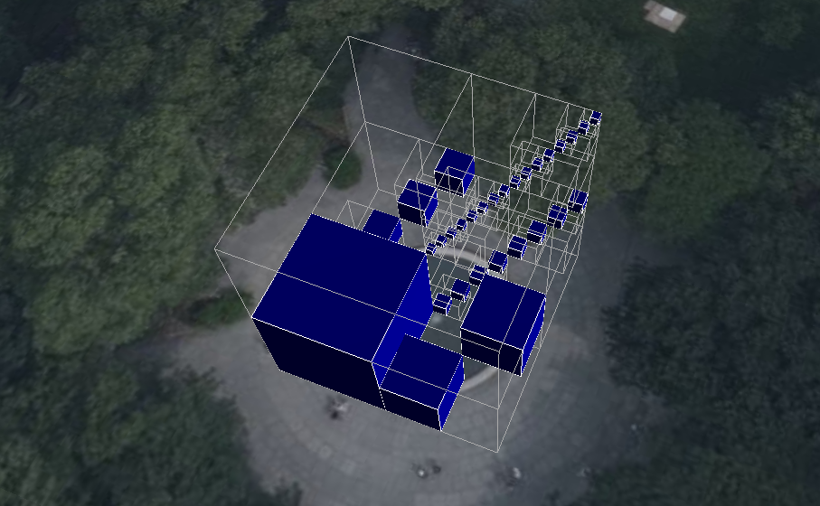

# Sparse implicit octree

An example tileset that uses the [Implicit Tiling](https://github.com/CesiumGS/3d-tiles/tree/main/specification/ImplicitTiling) to represent a small, sparse octree. 

The quadtree has 6 available levels, and each subtree has 3 levels. There are 31 tiles with content in the tree: 

- 1 tile in level 1
- 2 tiles in level 2
- 4 tiles in level 3
- 8 tiles in level 4
- 16 tiles in level 5. 

Each content is a simple glTF asset as a GLB (glTF binary) file that just consists of a portion of the unit cube that corresponds to the extent of the respective tile. No other tiles - except for the ones that have content, and their respective ancestors - are available. 

## Screenshot



## Sandcastle Code

```JavaScript
const viewer = new Cesium.Viewer("cesiumContainer");

// Create the tileset in the viewer
const tileset = viewer.scene.primitives.add(
  await Cesium.Cesium3DTileset.fromUrl(
    "http://localhost:8003/1.1/SparseImplicitOctree/tileset.json",
    {
      debugShowBoundingVolume: true,
    }
  )
);

// Move the tileset to a certain position on the globe,
// and scale it up
const transform = Cesium.Transforms.eastNorthUpToFixedFrame(
  Cesium.Cartesian3.fromDegrees(-75.152408, 39.946975, 1)
);
const scale = 15.0;
tileset.modelMatrix = Cesium.Matrix4.multiplyByUniformScale(
  transform,
  scale,
  new Cesium.Matrix4()
);

// Zoom to the tileset, with a small offset so that
// it is fully visible
const offset = new Cesium.HeadingPitchRange(
  0,
  Cesium.Math.toRadians(-67.5),
  40.0
);
viewer.zoomTo(tileset, offset);
```

## License

[CC0](https://creativecommons.org/share-your-work/public-domain/cc0/)

