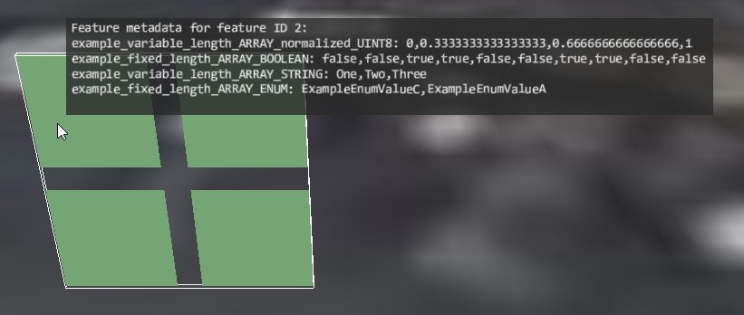

# Complex Types

This sample demonstrates usage of the [`EXT_mesh_features`](https://github.com/CesiumGS/glTF/tree/3d-tiles-next/extensions/2.0/Vendor/EXT_mesh_features) extension for storing metadata with complex types.

The sample contains a glTF asset with a single mesh primitive. The mesh primitive consists of a quad (the unit square), formed by 2 triangles. The vertices in this mesh primitive have the usual `POSITION` and `NORMAL` attributes. 

### Feature IDs

The basic structure and definition of the feature IDs for this example is the same as for the [ExplicitFeatureIds](../ExplicitFeatureIds#feature-ids) example.

### Metadata Structure

The structure of the metadata is defined with an [`EXT_mesh_features` schema](https://github.com/CesiumGS/glTF/tree/3d-tiles-next/extensions/2.0/Vendor/EXT_mesh_features#schema-definitions) that contains a single class. The class contains several properties:

- a variable-length `ARRAY` property with _normalized_ `UINT8` values
- a fixed-length `ARRAY` property with `BOOLEAN` values
- a variable-length `ARRAY` property with `STRING` values
- a fixed-length `ARRAY` property with `ENUM` values

The latter refer to a simple example `ENUM` class that is also defined in the schema.

### Metadata Instances

The actual instances of this class, which are associated with the feature IDs, are defined with a [property table](https://github.com/CesiumGS/glTF/tree/3d-tiles-next/extensions/2.0/Vendor/EXT_mesh_features#property-tables). The rows of this table correspond to the feature IDs. The columns of this table correspond to the properties of the class. The data for each column is stored in a standard glTF `bufferView`. 

Based on the type information from the metadata class, the contents of these buffer views is interpreted as follows:

```JSON
"example_variable_length_ARRAY_normalized_UINT8" : [
    [ 0, 255 ],
    [ 0, 128, 255 ],
    [ 0, 85, 170, 255 ],
    [ 0, 64, 128, 192, 255 ]
],
"example_fixed_length_ARRAY_BOOLEAN" : [
    [ true, false, true, false, true, false, true, false, true, false ],
    [ true, true, false, false, true, true, false, false, true, true ],
    [ false, false, true, true, false, false, true, true, false, false ],
    [ false, true, false, true, false, true, false, true, false, true ]
],
"example_variable_length_ARRAY_STRING" : [
    [ "One" ],
    [ "One", "Two" ],
    [ "One", "Two", "Three" ],
    [ "One", "Two", "Theee", "Four" ]
],
"example_fixed_length_ARRAY_ENUM" : [
    [ 0, 1 ],
    [ 1, 2 ],
    [ 2, 0 ],
    [ 1, 2 ]
]
```

Notes:

- The actual values for the `example_variable_length_ARRAY_normalized_UINT8` property are shown as the raw values. These values will be normalized to the [0.0,1.0] range due to the normalization
- The values for the `example_fixed_length_ARRAY_ENUM` are the numbers that correspond to the three enum constants that are defined in the example enum.

## Screenshot



## Example Sandcastle

This example can be viewed with the [common `EXT_mesh_features` sandcastle](../#common-sandcastle-code)


## License

[CC0](https://creativecommons.org/share-your-work/public-domain/cc0/)
