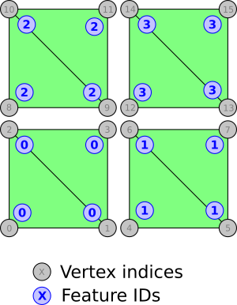

# Explicit Feature IDs

This sample demonstrates usage of the [`EXT_mesh_features`](https://github.com/CesiumGS/glTF/tree/3d-tiles-next/extensions/2.0/Vendor/EXT_mesh_features) extension for storing feature IDs for vertices of a mesh.

The sample contains a glTF asset with a single mesh primitive. The mesh primitive consists of 4 quads (each formed by 2 triangles). The vertices in this mesh primitive have the usual `POSITION` and `NORMAL` vertex attributes. 

### Feature IDs

Additionally, each vertex has a _feature ID_. In this example, the feature ID is given _explicitly_, as a [vertex attribute](https://github.com/CesiumGS/glTF/tree/3d-tiles-next/extensions/2.0/Vendor/EXT_mesh_features#vertex-attribute). (See [ImplicitFeatureIds](../ImplicitFeatureIds/) for an example of _implicit_ feature IDs)

The mesh primitive contains a `FEATURE_ID_0` attribute. This attribute refers to a standard glTF accessor with type `"SCALAR"` and component type `UNSIGNED_BYTE`, so that each vertex is associated with one `UNSIGNED_BYTE` value as its feature ID.

The following image shows the mesh primitive with its vertices, their indices, and their feature IDs:

## Example Sandcastle

This example can be viewed with the [common `EXT_mesh_features` sandcastle](../#common-sandcastle-code)

## License

[CC0](https://creativecommons.org/share-your-work/public-domain/cc0/)
