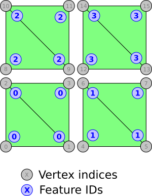

# Implicit Feature IDs

This sample demonstrates usage of the [`EXT_mesh_features`](https://github.com/CesiumGS/glTF/tree/3d-tiles-next/extensions/2.0/Vendor/EXT_mesh_features) extension for storing feature IDs for vertices of a mesh.

The sample contains a glTF asset with a single mesh primitive. The mesh primitive consists of 4 quads (each formed by 2 triangles). The vertices in this mesh primitive have the usual `POSITION` and `NORMAL` vertex attributes. 

### Feature IDs

Each vertex has a _feature ID_. In this sample, the feature ID is given as an [_implicit_ vertex attribute](https://github.com/CesiumGS/glTF/tree/3d-tiles-next/extensions/2.0/Vendor/EXT_mesh_features#implicit-vertex-attribute). (See [ExplicitFeatureIds](../ExplicitFeatureIds/) for an example of _explicit_ feature IDs)

 In the _implicit_ representation, no additional data has to be stored for the feature IDs. Instead, the feature IDs for the vertices are defined by two parameters:

- The `offset` defines the feature ID that the first vertex should receive
- The `repeat` defines how many consecutive vertices should receive the same feature ID

In this example, with `offset=0` and `repeat=4`, the vertices of each quad receive the same feature ID.

The following image shows the mesh primitive with its vertices, their indices, and their feature IDs:

## Example Sandcastle

(This will be added soon)

## License

[CC0](https://creativecommons.org/share-your-work/public-domain/cc0/)

