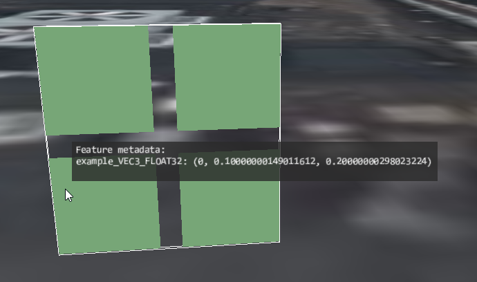

# Implicit Feature IDs and Simple Property

This sample demonstrates usage of the [`EXT_mesh_features`](https://github.com/CesiumGS/glTF/tree/3d-tiles-next/extensions/2.0/Vendor/EXT_mesh_features) extension for storing feature IDs and properties associated with vertices of a mesh.

### Feature IDs

The basic structure and definition of the feature IDs for this example is the same as for the [ImplicitFeatureIds](../ImplicitFeatureIds#feature-ids) example.

Additionally, this sample defines metadata that is associated with the feature IDs. The metadata in this example is the same as in the [ExplicitFeatureIdsAndSimpleProperty](../ExplicitFeatureIdsAndSimpleProperty/) example.

### Metadata Structure

The structure of the metadata is defined with an [`EXT_mesh_features` schema](https://github.com/CesiumGS/glTF/tree/3d-tiles-next/extensions/2.0/Vendor/EXT_mesh_features#schema-definitions) that contains a single class. The class only contains a single property, called `example_VEC3_FLOAT32`. The type of this property is a 3D vector with 32 bit floating-point components, as indicated by the type `"VEC3"` and the component type `"FLOAT32"`. 

### Metadata Instances

The actual instances of this class, which are associated with the feature IDs, are defined with a [property table](https://github.com/CesiumGS/glTF/tree/3d-tiles-next/extensions/2.0/Vendor/EXT_mesh_features#property-tables). The rows of this table correspond to the feature IDs. The columns of this table correspond to the properties of the class. The data for each column is stored in a standard glTF `bufferView`. 

Based on the type information from the metadata class, the contents of this buffer view is interpreted as four 3D vectors with 32 bit floating point components:

```JSON
"example_VEC3_FLOAT32" : [
  0.0, 0.1, 0.2,
  1.0, 1.1, 1.2,
  2.0, 2.1, 2.2,
  3.0, 3.1, 3.2
]
```

## Screenshot



## Example Sandcastle

The following sandcastle shows how the tileset for this example can be loaded from a local server, and how to obtain and display the metadata:

```JavaScript
// Enable experimental features for metadata access
Cesium.ExperimentalFeatures.enableModelExperimental = true;

var viewer = new Cesium.Viewer('cesiumContainer');

// Create the tileset
var tileset = viewer.scene.primitives.add(new Cesium.Cesium3DTileset({
    url : 'http://localhost:8003/EXT_mesh_features/ImplicitFeatureIdsAndSimpleProperty/tileset.json',
    debugShowBoundingVolume: true
}));

// Move the tileset to a certain position on the globe
tileset.modelMatrix = Cesium.Transforms.eastNorthUpToFixedFrame(
  Cesium.Cartesian3.fromDegrees(-75.1596759, 39.9509025, 0));

viewer.zoomTo(tileset);

// Create the label that will display metadata information
var labelEntity = viewer.entities.add({
  label: {
    showBackground: true,
    font: "14px monospace",
    horizontalOrigin: Cesium.HorizontalOrigin.LEFT,
    verticalOrigin: Cesium.VerticalOrigin.BOTTOM,
    pixelOffset: new Cesium.Cartesian2(10, -10),
    // Workaround to always render label on top:
    disableDepthTestDistance: Number.POSITIVE_INFINITY,
  },
});

// Adds metadata information to the label, with the given title.
// The given metadata object is assumed to be a Cesium3DTileFeature.
var addMetadataToLabel = function(title, metadata) {
  labelEntity.label.text += title + ":\n";
  
  // Iterate over all property names in the metadata, 
  // and add a row containing the property name and
  // the value of this property to the label:
  var propertyKeys = metadata.getPropertyNames();
  for (var i=0; i<propertyKeys.length; i++) {
    var propertyKey = propertyKeys[i];
    var propertyValue = metadata.getProperty(propertyKey);          
    //console.log("propertyKey", propertyKey);
    //console.log("propertyValue", propertyValue);
    labelEntity.label.text += propertyKey + ": "+ propertyValue;
    labelEntity.label.text += "\n";
  }
};

// Install the handler that will perform picking when the 
// mouse is moved, and update the label entity when the 
// mouse is over something that contains metadata.
var handler = new Cesium.ScreenSpaceEventHandler(viewer.scene.canvas);
handler.setInputAction(function (movement) {
  labelEntity.label.text = "";
  var picked = viewer.scene.pick(movement.endPosition);
  //console.log("picked ", picked);
  
  // Check if the mouse is over a `Cesium3DTileFeature`, which
  // represents the metadata information:
  if (!Cesium.defined(picked)) {
    return;
  }
  var isFeatureMetadata = picked instanceof Cesium.Cesium3DTileFeature;
  if (!isFeatureMetadata) {
    return;
  }
  
  // Show the metadata in the label
  addMetadataToLabel("Feature metadata", picked);
  
  // Move the label to the mouse position
  var cartesian = viewer.scene.pickPosition(movement.endPosition);
  labelEntity.position = cartesian;  
  
}, Cesium.ScreenSpaceEventType.MOUSE_MOVE);
```


## License

[CC0](https://creativecommons.org/share-your-work/public-domain/cc0/)


