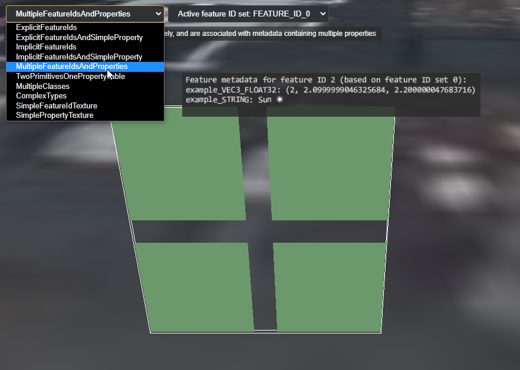

# Samples for `EXT_mesh_features` 

The [`EXT_mesh_features`](https://github.com/CesiumGS/glTF/tree/3d-tiles-next/extensions/2.0/Vendor/EXT_mesh_features) extension is a glTF 2.0 extension that allows storing structured metadata associated with geometry or subcomponents of geometry in glTF 2.0 assets.

The following is a list of samples that present different features of the `EXT_mesh_features` extension: 

- [`ExplicitFeatureIds`](ExplicitFeatureIds): Explicit feature IDs for the vertices, without associated properties
- [`ExplicitFeatureIdsAndSimpleProperty`](ExplicitFeatureIdsAndSimpleProperty): Explicit feature IDs for the vertices, where each ID is associated with a 3D float vector property
- [`ImplicitFeatureIds"`](ImplicitFeatureIds): Implicit feature IDs for the vertices, without associated properties
- [`ImplicitFeatureIdsAndSimpleProperty`](ImplicitFeatureIdsAndSimpleProperty): Implicit feature IDs for the vertices where each ID is associated with a 3D float vector property
- [`MultipleFeatureIdsAndProperties`](MultipleFeatureIdsAndProperties): Multiple feature IDs that can be activated separately, and are associated with metadata containing multiple properties
- [`TwoPrimitivesOnePropertyTable`](TwoPrimitivesOnePropertyTable): Two mesh primitives that define feature IDs, where both refer to the same property table
- [`MultipleClasses`](MultipleClasses): Multiple feature IDs that can be activated separately, and are associated with different metadata classes
- [`ComplexTypes`](ComplexTypes): Features that contain properties with more complex types
- [`SimpleFeatureIdTexture`](SimpleFeatureIdTexture): Feature IDs that are defined using a feature ID texture, and associated with example metadata stored in a property table
- [`SimplePropertyTexture`](SimplePropertyTexture): Properties that are stored in a texture, without feature IDs


Each directory contains a dedicated `.gltf` file that contains the actual glTF asset. Additionally, each directory also contains a simple `tileset.json` file that is a [3D Tiles](https://github.com/CesiumGS/3d-tiles) tileset which just contains the respective glTF asset as its only content. These tilesets can be viewed in CesiumJS, by hosting the base directory of this repository on a local server, and using the following Cesium Sandcastle code:

## Common Sandcastle Code

```JavaScript
// Enable experimental features for metadata access
Cesium.ExperimentalFeatures.enableModelExperimental = true;

var viewer = new Cesium.Viewer('cesiumContainer');

// Stores the tileset that is currently selected
var currentTileset;

// Stores the currently selected feature ID index, which
// is the index of `FEATURE_ID_n`
var currentActiveFeatureIdSetIndex = 0;

// Creates the tileset for the sample with the given name.
var createTileset = function(exampleName) {
  if (Cesium.defined(currentTileset)) {
    viewer.scene.primitives.remove(currentTileset);
    currentTileset = undefined;
  }
  // Create the tileset, and move it to a certain position on the globe
  currentTileset = viewer.scene.primitives.add(new Cesium.Cesium3DTileset({
      url : 'http://localhost:8003/EXT_mesh_features/'+exampleName+'/tileset.json',
      debugShowBoundingVolume: true
  }));
  currentTileset.modelMatrix = Cesium.Transforms.eastNorthUpToFixedFrame(
    Cesium.Cartesian3.fromDegrees(-75.1596759, 39.9509025, 0));
  viewer.zoomTo(currentTileset);
  
  // Make sure that picking refers to the FEATURE_ID index that
  // is currently selected in the UI
  currentTileset.featureIdIndex = currentActiveFeatureIdSetIndex;
};


// Create the label that will display metadata information
var labelEntity = viewer.entities.add({
  label: {
    showBackground: true,
    font: "14px monospace",
    horizontalOrigin: Cesium.HorizontalOrigin.LEFT,
    verticalOrigin: Cesium.VerticalOrigin.BOTTOM,
    pixelOffset: new Cesium.Cartesian2(10, -10),
    // Workaround to always render label on top:
    disableDepthTestDistance: Number.POSITIVE_INFINITY,
  },
});


// Adds metadata information to the label, with 
// the given title indicating which granularity
// of metadata this is. The given metadata object
// must be a Cesium3DTileFeature
var addFeatureMetadataToLabel = function(title, metadata) {
  if (!Cesium.defined(metadata)) {
    labelEntity.label.text += "(No " + title + ")\n";
    return;
  }
  var propertyKeys = metadata.getPropertyNames();
  labelEntity.label.text += title + 
    " for feature ID " + metadata.featureId + 
    " (based on feature ID set " + currentTileset.featureIdIndex + ")" +
    ":\n";
  for (var i=0; i<propertyKeys.length; i++) {
    var propertyKey = propertyKeys[i];
    var propertyValue = metadata.getProperty(propertyKey);          
    //console.log("propertyKey", propertyKey);
    //console.log("propertyValue", propertyValue);
    labelEntity.label.text += propertyKey + ": "+ propertyValue;
    labelEntity.label.text += "\n";
  }
};

// Given an object that was obtained via Scene#pick: If it is 
// a Cesium3DTileFeature, then it is returned.
// Otherwise, 'undefined' is returned.
var obtainFeatureMetadata = function(picked) {
  if (!Cesium.defined(picked)) {
    return undefined;
  }
  var metadata = picked;
  var isFeatureMetadata = metadata instanceof Cesium.Cesium3DTileFeature;
  if (!isFeatureMetadata) {
    return undefined;
  }
  return metadata;
};

// Install the handler that will perform picking when the 
// mouse is moved, and update the label entity when the 
// mouse is over something that contains metadata.
var handler = new Cesium.ScreenSpaceEventHandler(viewer.scene.canvas);
handler.setInputAction(function (movement) {
  labelEntity.label.text = "";
  var picked = viewer.scene.pick(movement.endPosition);
  
  //console.log("picked ", picked);
  //debugger;

  var featureMetadata = obtainFeatureMetadata(picked);
  addFeatureMetadataToLabel("Feature metadata", featureMetadata);
  
  var cartesian = viewer.scene.pickPosition(movement.endPosition);
  labelEntity.position = cartesian;  
  
}, Cesium.ScreenSpaceEventType.MOUSE_MOVE);


//============================================================================
// Sandcastle UI setup:

// Create a label that will show some information for
// the currently selected example
var infoTextDisplay = document.createElement("div");
infoTextDisplay.style.background = "rgba(42, 42, 42, 0.7)";
infoTextDisplay.style.padding = "5px 10px";
infoTextDisplay.style.marginTop = "5px";
var setInfoText = function(infoText) {
  infoTextDisplay.textContent = infoText;
};

// Create one entry for the list of examples that can
// be selected in the dropdown menu. Selecting one of
// these will load the tileset for the sample with the
// given name, and display the given info text in the
// infoTexDisplay
var createSampleOption = function(name, infoText) {
  return {
    text: name,
    onselect: function () {
      createTileset(name);
      setInfoText(infoText);
    },
  };
};

// Create the list of available samples, and add them
// to the sandcastle toolbar
var sampleOptions = [
  createSampleOption("ExplicitFeatureIds",
    "Explicit feature IDs for the vertices, " +
    "without associated properties"),
  
  createSampleOption("ExplicitFeatureIdsAndSimpleProperty",
    "Explicit feature IDs for the vertices," +
    "where each ID is associated with a 3D float vector property"),
  
  createSampleOption("ImplicitFeatureIds", 
    "Implicit feature IDs for the vertices, " +
    "without associated properties"),
  
  createSampleOption("ImplicitFeatureIdsAndSimpleProperty", 
    "Implicit feature IDs for the vertices," +
    "where each ID is associated with a 3D float vector property"),

  createSampleOption("MultipleFeatureIdsAndProperties", 
    "Multiple feature IDs that can be activated separately, " +
    "and are associated with metadata containing multiple properties"),

  createSampleOption("TwoPrimitivesOnePropertyTable", 
    "Two mesh primitives that define feature IDs, where both refer " +
    "to the same property table"),
  
  createSampleOption("MultipleClasses", 
    "Multiple feature IDs that can be activated separately, " +
    "and are associated with different metadata classes"),
  
  createSampleOption("ComplexTypes", 
    "Features that contain properties with more complex types"),

  createSampleOption("SimpleFeatureIdTexture", 
    "Feature IDs that are defined using a feature ID texture, " + 
    "and associated with example metadata stored in a property table"),
  
  createSampleOption("SimplePropertyTexture", 
    "Properties that are stored in a texture, without feature IDs"),
  
];
Sandcastle.addToolbarMenu(sampleOptions);

// Creates an option for selecting the active feature ID set
// with the given index
var createFeatureIdSetOption = function(index) {
  return {
    text: 'Active feature ID set: FEATURE_ID_' + index,
    onselect: function () {
      currentActiveFeatureIdSetIndex = index;
      currentTileset.featureIdIndex = index;
    },
  };
};

// Create the list of available feature ID sets, and add them
// to the sandcastle toolbar
var featureIdSetOptions = [
  createFeatureIdSetOption(0),
  createFeatureIdSetOption(1)
];
Sandcastle.addToolbarMenu(featureIdSetOptions);

// Add the component that will dispplay the info text
// to the sandcastle toolbar
document.getElementById("toolbar").appendChild(infoTextDisplay);
```

## Screenshot



