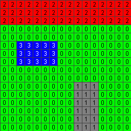
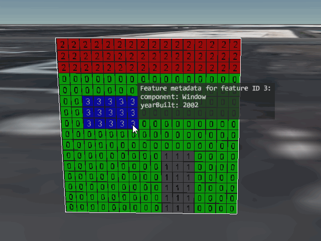

# Simple Feature ID Texture

This sample demonstrates usage of the [`EXT_mesh_features`](https://github.com/CesiumGS/glTF/tree/3d-tiles-next/extensions/2.0/Vendor/EXT_mesh_features) extension for storing feature IDs and properties associated with the surface of a primitive, using a feature ID texture.

The sample contains a glTF asset with a single mesh primitive. The mesh primitive consists of a quad (the unit square), formed by 2 triangles. The vertices in this mesh primitive have the usual `POSITION`, `NORMAL`, and `TEXCOORD_0` vertex attributes. 

### Feature IDs

The feature IDs in this example are given with a [feature ID texture](https://github.com/CesiumGS/glTF/tree/3d-tiles-next/extensions/2.0/Vendor/EXT_mesh_features#feature-id-by-texture-coordinates). The feature ID texture has a size of 16x16 pixels, and defines feature IDs for components of a house.

The example also defines a standard texture that is used for _rendering_ the quad. It is a texture with a size of 256x256 pixels, that visualizes the feature IDs that are stored in the 16x16 pixel feature ID texture:



### Metadata Structure and Instances

The metadata in this example consists of a single example class inside an [`EXT_mesh_features` schema](https://github.com/CesiumGS/glTF/tree/3d-tiles-next/extensions/2.0/Vendor/EXT_mesh_features#schema-definitions), where the instances are defined with a [property table](https://github.com/CesiumGS/glTF/tree/3d-tiles-next/extensions/2.0/Vendor/EXT_mesh_features#property-tables). The class defines a `component` property that contains `STRING` elements indicating the component of the building, and a `yearBuilt` property that contains `INT16` elements, indicating the year when each component was built:

```JSON
"component" : [ 
    "Wall", "Door", "Roof", "Window"
],
"yearBuilt" : [
    1960, 1996, 1985, 2002  
]
```

## Screenshot



## Example Sandcastle

This example can be viewed with the [common `EXT_mesh_features` sandcastle](../#common-sandcastle-code)


## License

[CC0](https://creativecommons.org/share-your-work/public-domain/cc0/)
