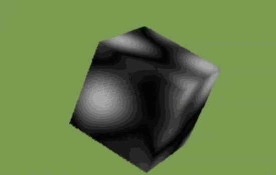
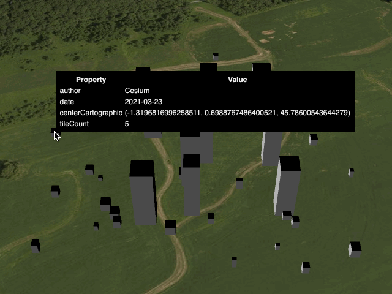
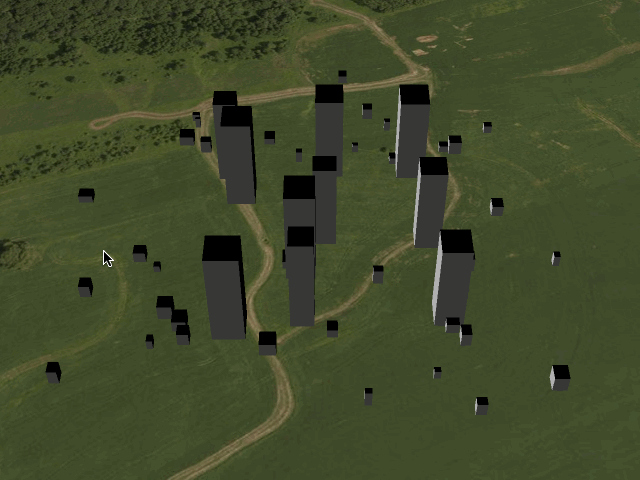
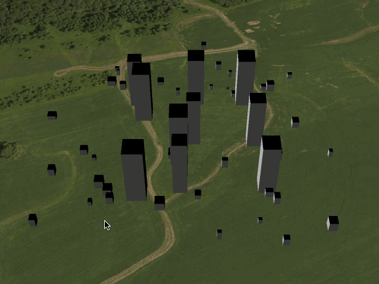
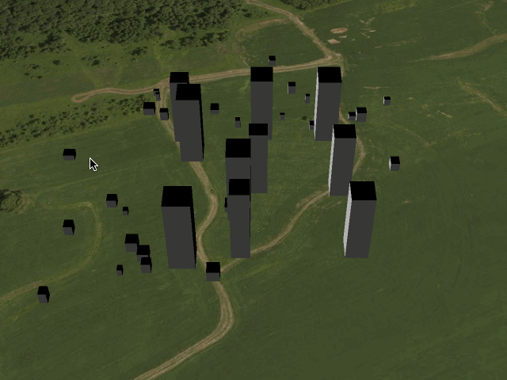

## Samples

Sample tilesets for learning how to use [3D Tiles 1.0](https://github.com/CesiumGS/3d-tiles) and  and [3D Tiles Next](https://github.com/CesiumGS/3d-tiles/tree/main/next).

### 3D Tiles 1.0

| Tileset | Screenshot |
| - | - |
| [TilesetWithDiscreteLOD](1.0/TilesetWithDiscreteLOD/README.md) |  |
| [TilesetWithExpiration](1.0/TilesetWithExpiration/README.md) |  |
| [TilesetWithRequestVolume](1.0/TilesetWithRequestVolume/README.md) |  |
| [TilesetWithTreeBillboards](1.0/TilesetWithTreeBillboards/README.md) |  |

### 3D Tiles Next

| Tileset | Screenshot |
| - | - |
| [TilesetWithTilesetMetadata](next/TilesetWithTilesetMetadata/README.md) |  |
| [TilesetWithTileMetadata](next/TilesetWithTileMetadata/README.md) |  |
| [TilesetWithGroupMetadata](next/TilesetWithGroupMetadata/README.md) |  |
| [TilesetWithExternalSchema](next/TilesetWithExternalSchema/README.md) |  |
| [ImplicitTilesetWithTileMetadata](next/ImplicitTilesetWithTileMetadata/README.md) |  |

## Contributions

Pull requests are appreciated!  Please use the same [Contributor License Agreement (CLA)](https://github.com/CesiumGS/cesium/blob/main/CONTRIBUTING.md) and [Coding Guide](https://github.com/CesiumGS/cesium/blob/main/Documentation/Contributors/CodingGuide/README.md) used for [CesiumJS](https://cesium.com/cesiumjs/).
