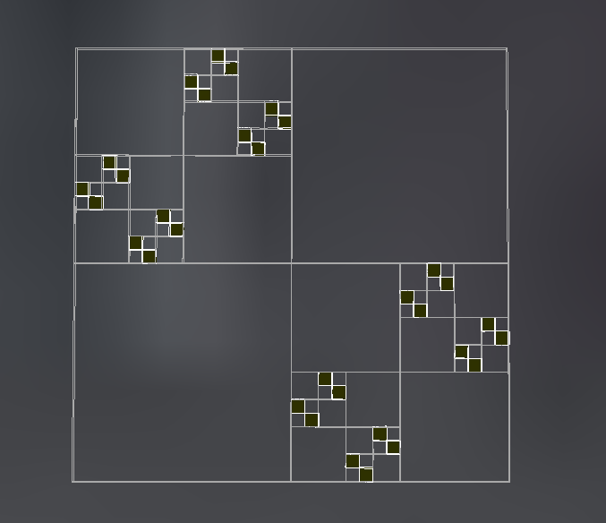
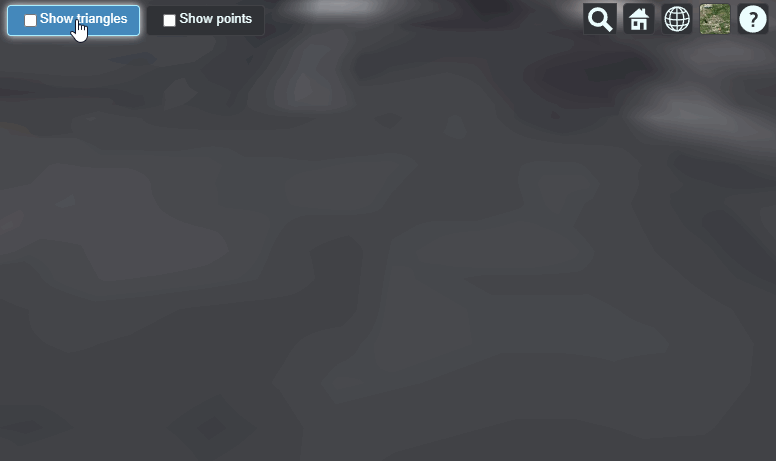

## Samples

Sample tilesets for learning how to use [3D Tiles](https://github.com/CesiumGS/3d-tiles).

See [INSTRUCTIONS.md](INSTRUCTIONS.md) for details of how to host these examples with a local sever.

### 3D Tiles 1.0

| Tileset | Screenshot |
| - | - |
| [TilesetWithDiscreteLOD](1.0/TilesetWithDiscreteLOD) |  |
| [TilesetWithExpiration](1.0/TilesetWithExpiration) |  |
| [TilesetWithRequestVolume](1.0/TilesetWithRequestVolume) |  |
| [TilesetWithTreeBillboards](1.0/TilesetWithTreeBillboards) |  |

### 3D Tiles Next

These samples use the draft extensions from [3D Tiles Next](https://github.com/CesiumGS/3d-tiles/tree/main/next) that have become part of the core specification in 3D Tiles 1.1.

| Tileset | Screenshot |
| - | - |
| [TilesetWithTilesetMetadata](next/TilesetWithTilesetMetadata) |  |
| [TilesetWithTileMetadata](next/TilesetWithTileMetadata) |  |
| [TilesetWithGroupMetadata](next/TilesetWithGroupMetadata) |  |
| [TilesetWithExternalSchema](next/TilesetWithExternalSchema) |  |
| [ImplicitTilesetWithTileMetadata](next/ImplicitTilesetWithTileMetadata) |  |
| [SparseImplicitQuadtree](next/SparseImplicitQuadtree) |  |
| [MultipleContents](next/MultipleContents) |  |

### 3D Tiles 1.1

| Tileset | Screenshot |
| - | - |
| [SparseImplicitQuadtree](1.1/SparseImplicitQuadtree) |  |

## Contributions

Pull requests are appreciated!  Please use the same [Contributor License Agreement (CLA)](https://github.com/CesiumGS/cesium/blob/main/CONTRIBUTING.md) and [Coding Guide](https://github.com/CesiumGS/cesium/blob/main/Documentation/Contributors/CodingGuide/README.md) used for [CesiumJS](https://cesium.com/cesiumjs/).
