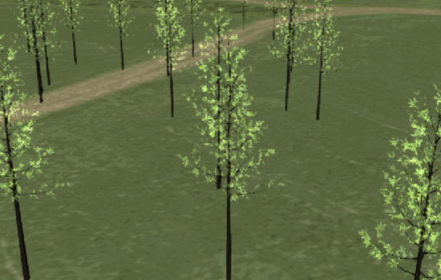

<p align="center"></p>

Sample tilesets for learning how to use [3D Tiles](https://github.com/AnalyticalGraphicsInc/3d-tiles) and a simple Node.js server for serving tilesets.

These tilesets are generated with [3d-tiles-samples-generator](https://github.com/AnalyticalGraphicsInc/3d-tiles-tools/tree/master/samples-generator).

## Instructions

Clone this repo and install [Node.js](http://nodejs.org/).  From the root directory of this repo, run:
```
npm install
```

Then to host the tilesets locally, run:
```
npm start
```

The tilesets are hosted at `http://localhost:8003/tilesets/`.

To load a tileset with Cesium use:

```javascript
var viewer = new Cesium.Viewer('cesiumContainer');

var tileset = viewer.scene.primitives.add(new Cesium.Cesium3DTileset({
    url : 'http://localhost:8003/tilesets/TilesetWithDiscreteLOD/tileset.json'
}));

viewer.zoomTo(tileset, new Cesium.HeadingPitchRange(0, -0.5, 0));
```

When testing tilesets using this server that you do not want to accidentally push to git, create a `localTilesets` directory, place the tilesets there, and access like `'http://localhost:8003/localTilesets/GitIgnoredTileset/'`.

Unless otherwise noted use the `3d-tiles` branch.

See the `README.md` in each tileset's directory for further instructions and usage restrictions.

| Model                                                  | Screenshot                                                            | Description|
|--------------------------------------------------------|-----------------------------------------------------------------------|------------|
| [Discrete LOD](tilesets/TilesetWithDiscreteLOD)        |         | Tileset with discrete LODs. |
| [Expiration](tilesets/TilesetWithExpiration)           |          | Tileset that expires and re-requests new content every five seconds. |
| [Request Volume](tilesets/TilesetWithRequestVolume)    |       | Tileset with request volumes. |
| [Tree Billboards](tilesets/TilesetWithTreeBillboards)  |      | Tileset that combines instanced 3D models and billboards. |

## Contributions

Pull requests are appreciated!  Please use the same [Contributor License Agreement (CLA)](https://github.com/AnalyticalGraphicsInc/cesium/blob/master/CONTRIBUTING.md) and [Coding Guide](https://github.com/AnalyticalGraphicsInc/cesium/blob/master/Documentation/Contributors/CodingGuide/README.md) used for [Cesium](http://cesiumjs.org/).
