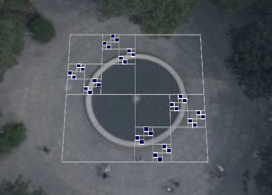
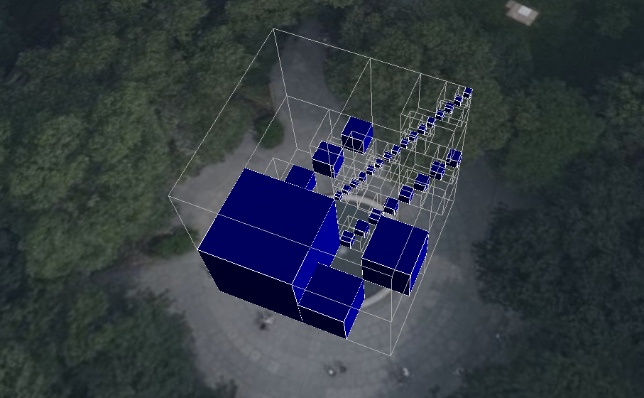
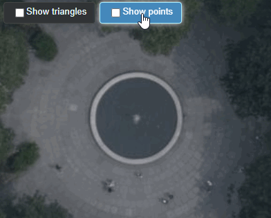

## Samples

Sample tilesets for learning how to use [3D Tiles](https://github.com/CesiumGS/3d-tiles).

See [INSTRUCTIONS.md](INSTRUCTIONS.md) for details of how to host these examples with a local sever.

### 3D Tiles 1.1

| Tileset | Screenshot |
| - | - |
| [MetadataGranularities](1.1/MetadataGranularities) |  |
| [SparseImplicitQuadtree](1.1/SparseImplicitQuadtree) |  |
| [SparseImplicitOctree](1.1/SparseImplicitOctree) |  |
| [MultipleContents](1.1/MultipleContents) |  |
| [BoundingBoxTests](1.1/BoundingBoxTests) |  |
| [TilesetWithFullMetadata](1.1/TilesetWithFullMetadata) |  |

### 3D Tiles 1.0

| Tileset | Screenshot |
| - | - |
| [TilesetWithDiscreteLOD](1.0/TilesetWithDiscreteLOD) |  |
| [TilesetWithRequestVolume](1.0/TilesetWithRequestVolume) |  |
| [TilesetWithTreeBillboards](1.0/TilesetWithTreeBillboards) |  |

### [glTF extensions](glTF)

Samples demonstrating the use of the [`EXT_mesh_features`](https://github.com/CesiumGS/glTF/tree/3d-tiles-next/extensions/2.0/Vendor/EXT_mesh_features) and [`EXT_structural_metadata`](https://github.com/CesiumGS/glTF/tree/3d-tiles-next/extensions/2.0/Vendor/EXT_structural_metadata) glTF extensions.

## Contributions

Pull requests are appreciated!  Please use the same [Contributor License Agreement (CLA)](https://github.com/CesiumGS/cesium/blob/main/CONTRIBUTING.md) and [Coding Guide](https://github.com/CesiumGS/cesium/blob/main/Documentation/Contributors/CodingGuide/README.md) used for [CesiumJS](https://cesium.com/cesiumjs/).
