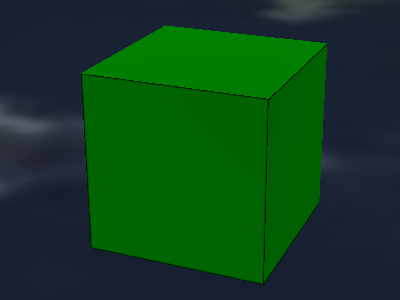

# Primitive Outline Rendering

A sample that uses the [`CESIUM_primitive_outline`](https://github.com/KhronosGroup/glTF/blob/main/extensions/2.0/Vendor/CESIUM_primitive_outline/README.md) extension to enable outline rendering for the edges of a unit cube.



## Example Sandcastle

```JavaScript
const viewer = new Cesium.Viewer("cesiumContainer");

// Create the tileset, and move it to a certain position on the globe
const tileset = viewer.scene.primitives.add(
  await Cesium.Cesium3DTileset.fromUrl(
    `http://localhost:8003/glTF/CESIUM_primitive_outline/BoxPrimitiveOutline/tileset.json`,
  )
);
tileset.modelMatrix = Cesium.Transforms.eastNorthUpToFixedFrame(
  Cesium.Cartesian3.fromDegrees(-75.152325, 39.94704, 2)
);
const offset = new Cesium.HeadingPitchRange(
  Cesium.Math.toRadians(-22.5),
  Cesium.Math.toRadians(-22.5),
  5.0
);
viewer.zoomTo(tileset, offset);
```

## Data structure

 The glTF asset contains a single mesh primitive. This mesh primitive is a unit cube. It defines the `CESIUM_primitive_outline` extension. The `indices` in this extension object refer to the accessor that contains indices. Each pair of indices in this accessor defines one edge that should be highlighted with outline rendering. Each of these edges must also appear as an edge in one of the triangles.

The cube consists of 6 faces, each consisting of 2 triangles. There are 24 vertices, because each of the 8 corners of the cube is used in 3 triangles, with different normals.

The vertex indices of the 12 faces are as follows:

- Face 0 is (0 2 1) (front)
- Face 1 is (0 3 2) (front)
- Face 2 is (4 6 5) (back)
- Face 3 is (4 7 6) (back)
- Face 4 is (8 10 9) (right)
- Face 5 is (8 11 10) (right)
- Face 6 is (12 14 13) (left)
- Face 7 is (12 15 14) (left)
- Face 8 is (16 18 17) (top)
- Face 9 is (16 19 18) (top)
- Face 10 is (20 22 21) (bottom)
- Face 11 is (20 23 22) (bottom)

The corresponding normals are 

- (0,0,-1) for front faces
- (0,0,1) for back faces
- (1,0,0) for right faces
- (-1,0,0) for left faces
- (0,1,0) for top faces
- (0,-1,1) for bottom faces

The positions of the 24 vertices are as follows:

- Vertex 0 is at (0, 0, 0)
- Vertex 1 is at (1, 0, 0)
- Vertex 2 is at (1, 1, 0)
- Vertex 3 is at (0, 1, 0)
- Vertex 4 is at (1, 0, 1)
- Vertex 5 is at (0, 0, 1)
- Vertex 6 is at (0, 1, 1)
- Vertex 7 is at (1, 1, 1)
- Vertex 8 is at (1, 0, 0)
- Vertex 9 is at (1, 0, 1)
- Vertex 10 is at (1, 1, 1)
- Vertex 11 is at (1, 1, 0)
- Vertex 12 is at (0, 0, 1)
- Vertex 13 is at (0, 0, 0)
- Vertex 14 is at (0, 1, 0)
- Vertex 15 is at (0, 1, 1)
- Vertex 16 is at (0, 1, 0)
- Vertex 17 is at (1, 1, 0)
- Vertex 18 is at (1, 1, 1)
- Vertex 19 is at (0, 1, 1)
- Vertex 20 is at (0, 0, 1)
- Vertex 21 is at (1, 0, 1)
- Vertex 22 is at (1, 0, 0)
- Vertex 23 is at (0, 0, 0)

There are 12 triangles, each consisting of 3 edges - so there are 36 edges in total. Given that a cube has 12 edges, only 12 of these 36 edges have to be highlighted with outline rendering. Therefore, the outline indices in the accessor that is referred to by the `CESIUM_primitive_outline.indices` are as follows:

- Outline 0 is (0, 1)
- Outline 1 is (1, 2)
- Outline 2 is (2, 3)
- Outline 3 is (3, 0)
- Outline 4 is (4, 5)
- Outline 5 is (5, 6)
- Outline 6 is (6, 7)
- Outline 7 is (7, 4)
- Outline 8 is (12, 13)
- Outline 9 is (8, 9)
- Outline 10 is (11, 10)
- Outline 11 is (14, 15)

## License

[CC0](https://creativecommons.org/share-your-work/public-domain/cc0/)
