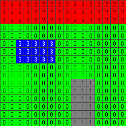

# Feature ID Texture

This sample demonstrates usage of the [`EXT_mesh_features`](https://github.com/CesiumGS/glTF/tree/3d-tiles-next/extensions/2.0/Vendor/EXT_mesh_features) extension for storing feature IDs and properties associated with the surface of a primitive, using a feature ID texture.

The sample contains a glTF asset with a single mesh primitive. The mesh primitive consists of a quad (the unit square), formed by 2 triangles. The vertices in this mesh primitive have the usual `POSITION`, `NORMAL`, and `TEXCOORD_0` vertex attributes. 

### Feature IDs

The feature IDs in this example are given with a [feature ID texture](https://github.com/CesiumGS/glTF/tree/3d-tiles-next/extensions/2.0/Vendor/EXT_mesh_features#feature-id-by-texture-coordinates). The feature ID texture has a size of 16x16 pixels, and defines feature IDs for components of a house.

The example also defines a standard texture that is used for _rendering_ the quad. It is a texture with a size of 256x256 pixels, that shows the feature IDs that are stored in the 16x16 pixel feature ID texture:

## Screenshot

## Example Sandcastle

This example can be viewed with the [common sandcastle code](../../README.md#common-sandcastle-code).

## License

[CC0](https://creativecommons.org/share-your-work/public-domain/cc0/)
