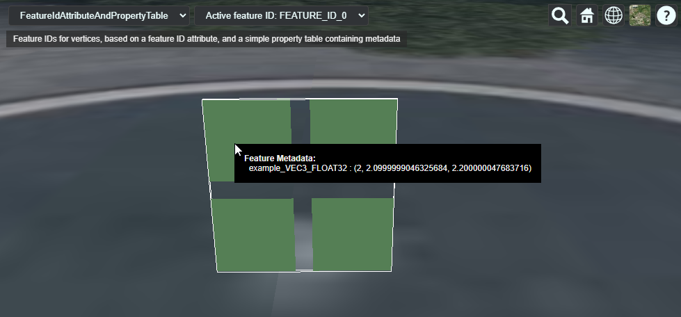

# Feature ID Attribute and Property Table

This sample demonstrates usage of the [`EXT_structural_metadata`](https://github.com/CesiumGS/glTF/tree/3d-tiles-next/extensions/2.0/Vendor/EXT_structural_metadata) extension for storing a property table with metadata that is looked up based on feature IDs. 

### Feature IDs

The sample uses the [`EXT_mesh_features`](https://github.com/CesiumGS/glTF/tree/3d-tiles-next/extensions/2.0/Vendor/EXT_mesh_features) extension for storing feature IDs that are associated with vertices of a mesh. The basic structure and definition of the feature IDs for this example is the same as for the [FeatureIdAttribute](../../EXT_mesh_features/FeatureIdAttribute/README.md#feature-ids) example.

Additionally, this sample defines metadata that is associated with the feature IDs. 

### Metadata Structure

The structure of the metadata is defined with an `EXT_structural_metadata` _schema_ that contains a single class. The class only contains a single property, called `example_VEC3_FLOAT32`. The type of this property is a 3D vector with 32 bit floating-point components, as indicated by the type `"VEC3"` and the component type `"FLOAT32"`. 

### Metadata Entities

The metadata entities are the actual instances of this class. They are defined with an `EXT_structural_metadata` _property table_. The rows of this table correspond to the feature IDs. The columns of this table correspond to the properties of the class. The data for each column is stored in a standard glTF `bufferView`. 

Based on the type information from the metadata class, the contents of this buffer view is interpreted as four 3D vectors with 32 bit floating point components:

```JSON
"example_VEC3_FLOAT32" : [
  0.0, 0.1, 0.2,
  1.0, 1.1, 1.2,
  2.0, 2.1, 2.2,
  3.0, 3.1, 3.2
]
```

## Screenshot



## Example Sandcastle

This example can be viewed with the [common sandcastle code](../../README.md#common-sandcastle-code).

## License

[CC0](https://creativecommons.org/share-your-work/public-domain/cc0/)
