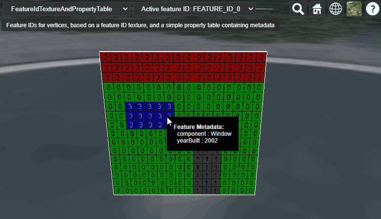

# Feature ID Texture And Property Table

This sample demonstrates usage of the [`EXT_structural_metadata`](https://github.com/CesiumGS/glTF/tree/3d-tiles-next/extensions/2.0/Vendor/EXT_structural_metadata) extension for storing a property table with metadata that is looked up based on feature IDs. 

The sample contains a glTF asset with a single mesh primitive. The mesh primitive consists of a quad (the unit square), formed by 2 triangles. The vertices in this mesh primitive have the usual `POSITION`, `NORMAL`, and `TEXCOORD_0` vertex attributes. 

### Feature IDs

The sample uses the [`EXT_mesh_features`](https://github.com/CesiumGS/glTF/tree/3d-tiles-next/extensions/2.0/Vendor/EXT_mesh_features) extension for storing feature IDs that are associated with the surface of a primitive, using a feature ID texture. The basic structure and definition of the feature IDs for this example is the same as for the [FeatureIdTexture](../../EXT_mesh_features/FeatureIdTexture/README.md#feature-ids) example.

Additionally, this sample defines metadata that is associated with the feature IDs. 

### Metadata Structure and Entities

The metadata in this example consists of a single example class inside an `EXT_structural_metadata` _schema_. The entities are the actual instances of this class, and are defined with an `EXT_structural_metadata` _property table_. The class defines a `component` property that contains `STRING` elements indicating the component of the building, and a `yearBuilt` property that contains `INT16` elements, indicating the year when each component was built:

```JSON
"component" : [ 
    "Wall", "Door", "Roof", "Window"
],
"yearBuilt" : [
    1960, 1996, 1985, 2002  
]
```

## Screenshot



## Example Sandcastle

This example can be viewed with the [common sandcastle code](../../README.md#common-sandcastle-code).

## License

[CC0](https://creativecommons.org/share-your-work/public-domain/cc0/)
