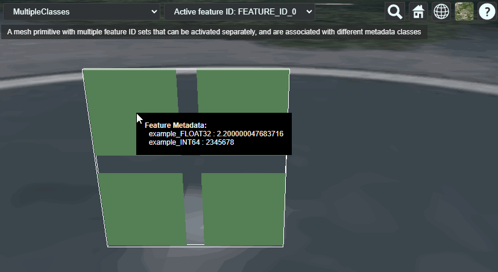

# Multiple Classes

This sample demonstrates usage of the [`EXT_structural_metadata`](https://github.com/CesiumGS/glTF/tree/3d-tiles-next/extensions/2.0/Vendor/EXT_structural_metadata) extension for storing a property table with metadata that is looked up based on feature IDs. 

The sample contains a glTF asset with a single mesh primitive. The mesh primitive consists of 4 quads (each formed by 2 triangles). The vertices in this mesh primitive have the usual `POSITION` and `NORMAL` vertex attributes. 

### Feature IDs

This example uses the same feature IDs as the the [MultipleFeatureIdsAndProperties](../MultipleFeatureIdsAndProperties#feature-ids) example. 


### Metadata Structure

The structure of the metadata is defined with an `EXT_structural_metadata` _schema_ that contains two classes:

- The first class is called `exampleMetadataClassA`, and has the following properties:
  - a property `"example_FLOAT32"`, with `FLOAT32` components
  - a property `"example_INT64"`, with `INT64` components

- The second class is called `exampleMetadataClassB`, and has the following properties:
  - a property `"example_UINT16"`, with `UINT16` components
  - a property `"example_FLOAT64"`, with, you guessed it, `FLOAT64` components


### Metadata Entities

The metadata entities are the actual instances of this class. They are defined with an `EXT_structural_metadata` _property table_ for each class. The rows of this table correspond to the feature IDs. The columns of this table correspond to the properties of the respective class. The data for each column is stored in a standard glTF `bufferView`. 

Based on the type information from the metadata classes, the contents of these buffer views are interpreted as follows:

The values for the property table for `exampleMetadataClassA`:
```JSON
"example_FLOAT32" : [
    1.1, 2.2, 3.3, 4.4
],
"example_INT64" : [
    1234567, 2345678, 3456789, 4567890
]
```
The values for the property table for `exampleMetadataClassB`:
```JSON
"example_UINT16" : [
    12345, 23456, 34567, 45678
],
"example_FLOAT64" : [
    1.234567, 2.345678, 3.456789, 4.567890
]
```

## Screenshot



## Example Sandcastle

This example can be viewed with the [common sandcastle code](../../README.md#common-sandcastle-code).

## License

[CC0](https://creativecommons.org/share-your-work/public-domain/cc0/)
