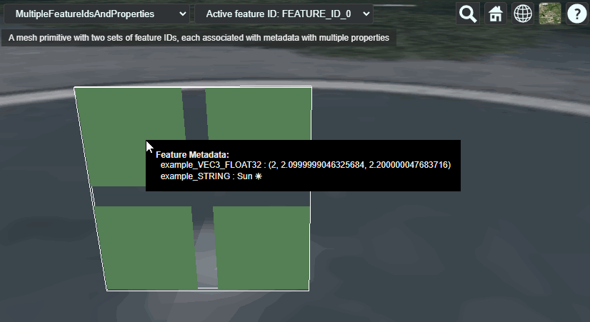

# Multiple Feature IDs and Properties

This sample demonstrates usage of the [`EXT_structural_metadata`](https://github.com/CesiumGS/glTF/tree/3d-tiles-next/extensions/2.0/Vendor/EXT_structural_metadata) extension for storing a property table with metadata that is looked up based on different feature IDs. 

The sample contains a glTF asset with a single mesh primitive. The mesh primitive consists of 4 quads (each formed by 2 triangles). The vertices in this mesh primitive have the usual `POSITION` and `NORMAL` vertex attributes. 

### Feature IDs

The sample uses the [`EXT_mesh_features`](https://github.com/CesiumGS/glTF/tree/3d-tiles-next/extensions/2.0/Vendor/EXT_mesh_features) extension for storing feature IDs that are associated with vertices of a mesh. Each vertex has two _feature IDs_. The first feature ID set is the same as for the [FeatureIdAttribute](../../EXT_mesh_features/FeatureIdAttribute/README.md#feature-ids) example. The second feature ID set simply contains the feature IDs in reverse order for demonstration purposes. So the vertex indices and their feature IDs are listed in this table:

Vertex Index | Feature ID 0 | Feature ID 1
|----|---|---|
|  0 | 0 | 3 |
|  1 | 0 | 3 |
|  2 | 0 | 3 |
|  3 | 0 | 3 |
|  4 | 1 | 2 |
|  5 | 1 | 2 |
|  6 | 1 | 2 |
|  7 | 1 | 2 |
|  8 | 2 | 1 |
|  9 | 2 | 1 |
| 10 | 2 | 1 |
| 11 | 2 | 1 |
| 12 | 3 | 0 |
| 13 | 3 | 0 |
| 14 | 3 | 0 |
| 15 | 3 | 0 |

Additionally, this sample defines metadata that is associated with the feature IDs. 

### Metadata Structure

The structure of the metadata is defined with an `EXT_structural_metadata` _schema_ that contains a single class. The class contains two properties. The first one called `example_VEC3_FLOAT32`, and is a 3D vector with 32 bit floating-point components. The second one is called `example_STRING`, and represents a single string.

### Metadata Entities

The metadata entities are the actual instances of this class. They are defined with an `EXT_structural_metadata` _property table_. The rows of this table correspond to the feature IDs. The columns of this table correspond to the properties of the class. The data for each column is stored in a standard glTF `bufferView`. 

Based on the type information from the metadata class, the contents of this buffer view is interpreted as four 3D vectors with 32 bit floating point components, and four strings, respectively:

```JSON
"example_VEC3_FLOAT32" : [
    0.0, 0.1, 0.2,
    1.0, 1.1, 1.2,
    2.0, 2.1, 2.2,
    3.0, 3.1, 3.2
],
"example_STRING" : [
    "Rain 🌧",
    "Thunder ⛈",
    "Sun ☀",
    "Snow 🌨"
]
```

## Screenshot



## Example Sandcastle

This example can be viewed with the [common sandcastle code](../../README.md#common-sandcastle-code).

## License

[CC0](https://creativecommons.org/share-your-work/public-domain/cc0/)
