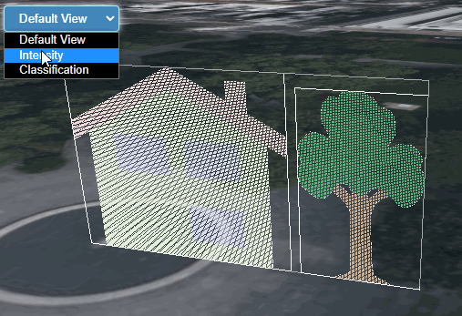

# Property Attributes Point Cloud

An example that shows how to combine different features of the `EXT_structural_metadata` and 3D Tiles.

### Sharing a metadata schema between glTF assets and a 3D Tiles tileset

The example uses a single metadata schema, as defined in the [3D Metadata Specification](https://github.com/CesiumGS/3d-tiles/tree/draft-1.1/specification/Metadata). The schema is stored in a `MetadataSchema.json` file, and defines a metadata class with two properties:

- an `intensity` property, which is a single floating point value
- a `classification` property, which is an enum with `MediumVegetation` and `Buildings` as its values

This schema file is referred to by glTF assets that use the `EXT_structural_metadata` extension, and by the 3D Tiles tileset that contains these glTF assets.

### Storing metadata in glTF property attributes

The glTF assets are simple point clouds, with [property attributes](https://github.com/CesiumGS/glTF/tree/proposal-EXT_structural_metadata/extensions/2.0/Vendor/EXT_structural_metadata#property-attributes) that contain the metadata values for the schema: Each point is assigned an `intensity` and a `classification` value.

### Defining statistics for the metadata values

The 3D Tiles tileset contains [metadata statistics](https://github.com/CesiumGS/3d-tiles/tree/draft-1.1/specification#metadata-statistics) for the metadata from the glTF assets. These statistics contain, for example, the minimum and maximum `intensity` value, and the number of occurences for each `classification` value.

## Screenshot



## Example Sandcastle

The following sandcastle can be used to render this sample, and allows selecting different custom shaders for visualizing the metadata:

```JavaScript
const viewer = new Cesium.Viewer("cesiumContainer");

// Load the tileset from a local server
const tileset = viewer.scene.primitives.add(
  new Cesium.Cesium3DTileset({
    url: `http://localhost:8003/glTF/EXT_structural_metadata/PropertyAttributesPointCloud//tileset.json`,
    debugShowBoundingVolume: true,
  })
);

// Move the tileset to a certain position on the globe,
// and zoom the viewer to the tileset
tileset.modelMatrix = Cesium.Transforms.eastNorthUpToFixedFrame(
  Cesium.Cartesian3.fromDegrees(-75.152325, 39.94704, 0)
);
const offset = new Cesium.HeadingPitchRange(
  Cesium.Math.toRadians(-22.5),
  Cesium.Math.toRadians(-22.5),
  32.0
);
viewer.zoomTo(tileset, offset);

// The dictionary of shaders that can be selected from the sandcastle menu:
const shaders = {
  // No custom shader, for default rendering
  NO_SHADER: undefined,

  // The shader that uses the `intensity` value from the metadata
  // and uses this as a (grayscale) color for the rendered points
  INTENSITY_SHADER: new Cesium.CustomShader({
    fragmentShaderText: `
    void fragmentMain(FragmentInput fsInput, inout czm_modelMaterial material)
    {
        float intensity = fsInput.metadata.intensity;
        material.diffuse = vec3(intensity);
    }
    `,
  }),

  // The shader that uses the `classification` value from the metadata
  // and uses this to select a color for rendering the points.
  
  // NOTE: The classification attribute is accessed in the vertex 
  // shader here. When it is accessed in the fragment shader, it
  // may not have exactly the expected value. This is tracked in
  // https://github.com/CesiumGS/cesium/issues/10699
  CLASSIFICATION_SHADER: new Cesium.CustomShader({
    varyings: {
      v_color: Cesium.VaryingType.VEC3,
    },
    vertexShaderText: `
    void vertexMain(VertexInput vsInput, inout czm_modelVertexOutput vsOutput) {
        int classif = int(vsInput.attributes.classification);
        
        vec3 color = vec3(1);
        if (classif == 0) {
            color = vec3(0,0.5,0);
        }
        else if (classif == 1) {
            color = vec3(0.5,0.5,0.5);
        }

        v_color = color;
    }`,
    fragmentShaderText: `
    void fragmentMain(FragmentInput fsInput, inout czm_modelMaterial material)
    {
        material.diffuse = v_color;
    }
    `,
  }),
};

// The Sandcastle UI setup: Create a menu for selecting the custom shaders
Sandcastle.addToolbarMenu([
  {
    text: "Default View",
    onselect: function () {
      tileset.customShader = shaders.NO_SHADER;
    },
  },
  {
    text: "Intensity",
    onselect: function () {
      tileset.customShader = shaders.INTENSITY_SHADER;
    },
  },
  {
    text: "Classification",
    onselect: function () {
      tileset.customShader = shaders.CLASSIFICATION_SHADER;
    },
  },
]);
```

## License

[CC0](https://creativecommons.org/share-your-work/public-domain/cc0/)
