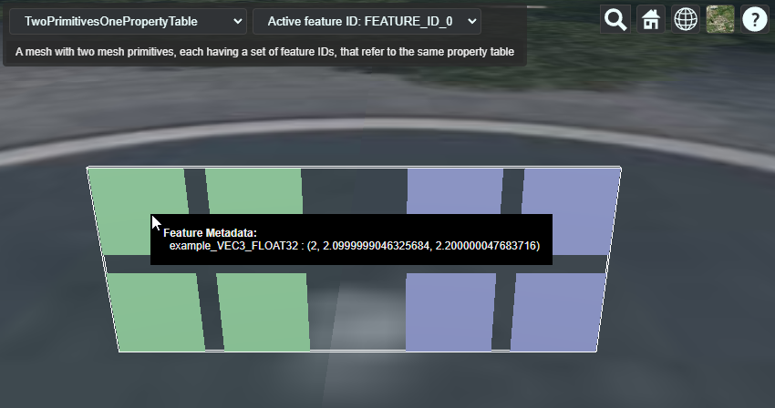

# Shared Property Table

This sample demonstrates usage of the [`EXT_structural_metadata`](https://github.com/CesiumGS/glTF/tree/3d-tiles-next/extensions/2.0/Vendor/EXT_structural_metadata) extension for storing a property table with metadata that is looked up based on feature IDs. 

### Metadata Structure and Entities

The structure and entities of the metadata in this example are the same as in the [FeatureIdAttributeAndPropertyTable](..//FeatureIdAttributeAndPropertyTable/) example. But in this case, a _single_ property table is associated with the feature IDs for _both_ mesh primitives, showing that it is possible to re-use property tables across multiple primitives in a single glTF asset. 

## Screenshot

## Example Sandcastle

This example can be viewed with the [common sandcastle code](../../README.md#common-sandcastle-code).

## License

[CC0](https://creativecommons.org/share-your-work/public-domain/cc0/)
