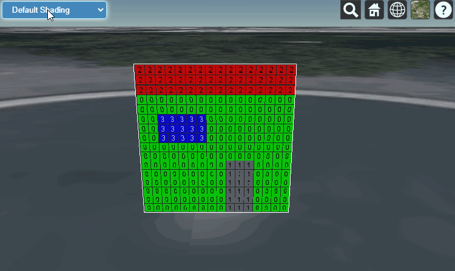

# Simple Property Texture

This sample demonstrates usage of the the [`EXT_structural_metadata`](https://github.com/CesiumGS/glTF/tree/3d-tiles-next/extensions/2.0/Vendor/EXT_structural_metadata) extension for storing properties associated with the surface of a primitive, using a property texture.

The sample contains a glTF asset with a single mesh primitive. The mesh primitive consists of a quad (the unit square), formed by 2 triangles. The vertices in this mesh primitive have the usual `POSITION`, `NORMAL`, and `TEXCOORD_0` vertex attributes. 

### Metadata Structure

The metadata in this example consists of a single example class inside an `EXT_structural_metadata` _schema_. This class defines properties of a building facade, namely the `insideTemperature`, `outsideTemperature`, and an `insulation` thickness. These first two properties are given as `UINT8` values, covering the range [0,255]. The `insulation` is given as a _normalized_ `UINT8` value, meaning that the raw values in the range [0,255] represent values in the range [0.0, 1.0]. 

The values for the class properties are stored in an `EXT_structural_metadata` _property texture_. The red, green, and blue channel of this texture stores the value for the `insideTemperature`, `outsideTemperature`, and `insulation`, respectively. 

## Screenshot

## Example Sandcastle

This example can be viewed with the [simple property texture sandcastle code](../../glTF-Property-Texture-Sandcastle.js).

## License

[CC0](https://creativecommons.org/share-your-work/public-domain/cc0/)
