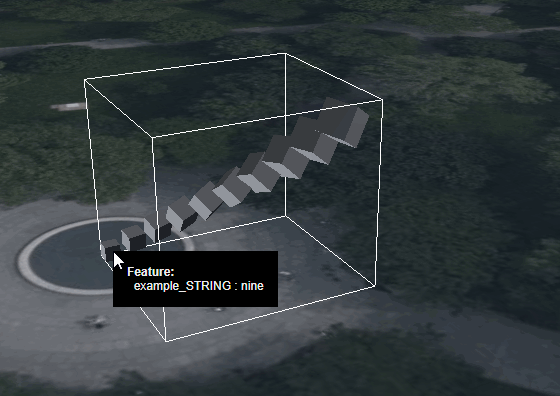

# Metadata for GPU instances

An example showing how to assign metadata to GPU instances. 

The example combines three different extensions:

- It uses `EXT_mesh_gpu_instancing` to create 10 GPU-based instances
- It uses `EXT_instance_features` to assign feature IDs to these instances
- It uses `EXT_structural_metadata` to define a property table with 10 rows, which can be looked up based on the feature IDs.

## Screenshot



## Example Sandcastle

```JavaScript
const viewer = new Cesium.Viewer("cesiumContainer");

// Create the tileset, and move it to a certain position on the globe
const tileset = viewer.scene.primitives.add(
  await Cesium.Cesium3DTileset.fromUrl(
    `http://localhost:8003/glTF/GpuInstancesMetadata/tileset.json`,
    {
      debugShowBoundingVolume: true,
    }
  )
);
tileset.modelMatrix = Cesium.Transforms.eastNorthUpToFixedFrame(
  Cesium.Cartesian3.fromDegrees(-75.152325, 39.94704, 0)
);
const offset = new Cesium.HeadingPitchRange(
  Cesium.Math.toRadians(22.5),
  Cesium.Math.toRadians(-22.5),
  40.0
);
viewer.zoomTo(tileset, offset);

// Create an HTML element that will serve as the
// tooltip that displays the feature information
function createTooltip() {
  const tooltip = document.createElement("div");
  viewer.container.appendChild(tooltip);
  tooltip.style.backgroundColor = "black";
  tooltip.style.position = "absolute";
  tooltip.style.left = "0";
  tooltip.style.top = "0";
  tooltip.style.padding = "14px";
  tooltip.style["pointer-events"] = "none";
  tooltip.style["block-size"] = "fit-content";
  return tooltip;
}
const tooltip = createTooltip();

// Show the given HTML content in the tooltip
// at the given screen position
function showTooltip(screenX, screenY, htmlContent) {
  tooltip.style.display = "block";
  tooltip.style.left = `${screenX}px`;
  tooltip.style.top = `${screenY}px`;
  tooltip.innerHTML = htmlContent;
}

// Create an HTML string that contains information
// about the given feature, under the given title
function createFeatureHtml(title, feature) {
  if (!Cesium.defined(feature)) {
    return `(No ${title})<br>`;
  }
  const propertyKeys = feature.getPropertyIds();
  if (!Cesium.defined(propertyKeys)) {
    return `(No properties for ${title})<br>`;
  }
  const id = feature.featureId;
  let html = `<b>${title} ${id}:</b><br>`;
  for (let i = 0; i < propertyKeys.length; i++) {
    const propertyKey = propertyKeys[i];
    const propertyValue = feature.getProperty(propertyKey);
    html += `&nbsp;&nbsp;${propertyKey} : ${propertyValue}<br>`;
  }
  return html;
}

// Given an object that was obtained via Scene#pick: If it is
// a Cesium3DTileFeature, then it is returned.
// Otherwise, 'undefined' is returned.
function obtainFeature(picked) {
  if (!Cesium.defined(picked)) {
    return undefined;
  }
  const isFeature = picked instanceof Cesium.Cesium3DTileFeature;
  if (!isFeature) {
    return undefined;
  }
  return picked;
}

// Install the handler that will perform picking when the
// mouse is moved, and update the label entity when the
// mouse is over a Cesium3DTileFeature
const handler = new Cesium.ScreenSpaceEventHandler(viewer.scene.canvas);
handler.setInputAction(function (movement) {
  let tooltipText = "";
  const picked = viewer.scene.pick(movement.endPosition);
  const feature = obtainFeature(picked);
  tooltipText += createFeatureHtml("Feature", feature);
  const screenX = movement.endPosition.x;
  const screenY = movement.endPosition.y;
  showTooltip(screenX, screenY, tooltipText);
}, Cesium.ScreenSpaceEventType.MOUSE_MOVE);
```

## License

[CC0](https://creativecommons.org/share-your-work/public-domain/cc0/)
