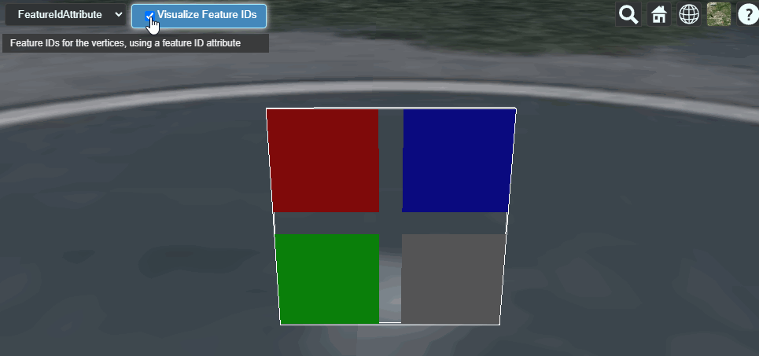
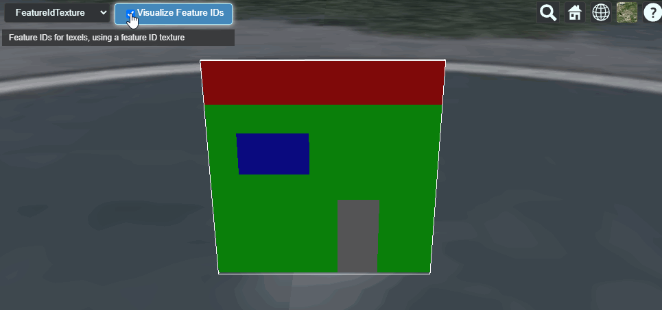
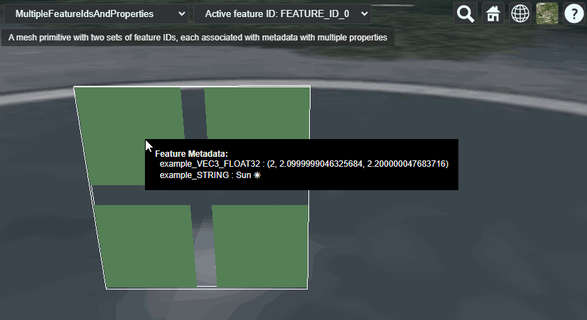
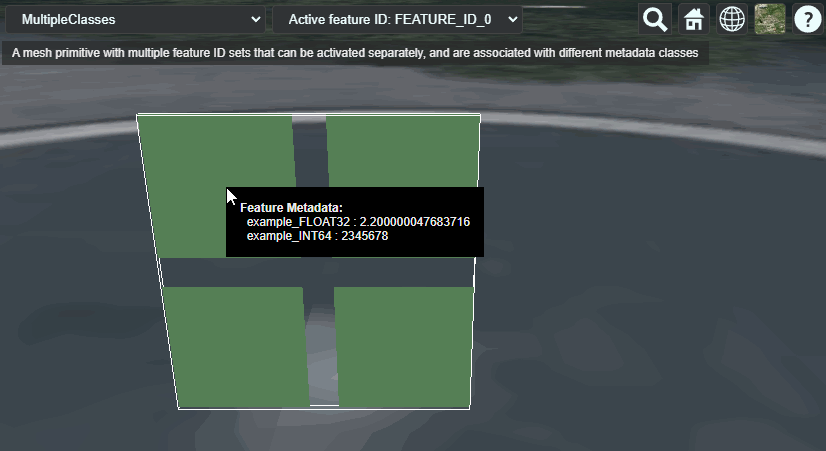

# Samples for glTF extensions 

The [`EXT_mesh_features`](https://github.com/CesiumGS/glTF/tree/3d-tiles-next/extensions/2.0/Vendor/EXT_mesh_features) extension is a glTF 2.0 extension that allows identifying geometry or subcomponents of geometry in glTF 2.0 assets as individual 'features', by associating them with a feature ID.

| Sample | Screenshot |
|:---|:--:|
| [`FeatureIdAttribute`](EXT_mesh_features/FeatureIdAttribute/)  Uses an attribute of a mesh primitive to assign feature IDs to vertices | 
| [`FeatureIdTexture`](EXT_mesh_features/FeatureIdTexture/)  Uses a feature ID texture to assign feature IDs to texels on the surface of the geometry | 

The [`EXT_structural_metadata`](https://github.com/CesiumGS/glTF/tree/3d-tiles-next/extensions/2.0/Vendor/EXT_structural_metadata) extension is a glTF 2.0 extension that allows storing structured metadata in glTF 2.0 assets in the form of _property tables_. Together with the [`EXT_mesh_features`](https://github.com/CesiumGS/glTF/tree/3d-tiles-next/extensions/2.0/Vendor/EXT_mesh_features) extension, the metadata can be looked up in these tables, using the feature IDs. 

| Sample | Screenshot |
|:---|:--:|
| [`FeatureIdAttributeAndPropertyTable`](EXT_structural_metadata/FeatureIdAttributeAndPropertyTable/)  Vertices that are associated with properties that are stored in a property table | 
| [`FeatureIdTextureAndPropertyTable`](EXT_structural_metadata/FeatureIdTextureAndPropertyTable/)  Texels that are associated with properties that are stored in a property table | 
| [`MultipleFeatureIdsAndProperties`](EXT_structural_metadata/MultipleFeatureIdsAndProperties/)  Multiple feature ID sets that are associated with metadata containing multiple properties | 
| [`SharedPropertyTable`](EXT_structural_metadata/SharedPropertyTable/)  Two mesh primitives that define feature IDs, where both refer to the same property table | 
| [`MultipleClasses`](EXT_structural_metadata/MultipleClasses/)  Two mesh primitives that define feature IDs, where both refer to the same property table | 
| [`ComplexTypes`](EXT_structural_metadata/ComplexTypes/)  Features that contain properties with more complex types | 
| [`SimplePropertyTexture`](EXT_structural_metadata/SimplePropertyTexture/)  Properties that are stored in a texture | 

Each directory contains a dedicated `.gltf` file that contains the actual glTF asset. Additionally, each directory also contains a simple `tileset.json` file that is a [3D Tiles](https://github.com/CesiumGS/3d-tiles) tileset which just contains the respective glTF asset as its only content. These tilesets can be viewed in CesiumJS, by hosting the base directory of this repository on a local server, and using the following Cesium Sandcastle code:

## Common Sandcastle Code

The sandcastle code for viewing the `EXT_mesh_features` samples is shown in [glTF-Mesh-Features-Samples-Sandcastle.js](glTF-Mesh-Features-Samples-Sandcastle.js)

The sandcastle code for viewing the `EXT_structural_metadata` samples is shown in [glTF-Structural-Metadata-Samples-Sandcastle.js](glTF-Structural-Metadata-Samples-Sandcastle.js)

