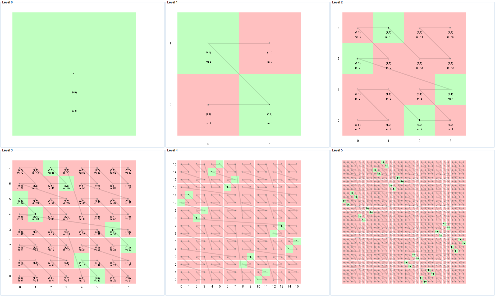

# Sparse implicit quadtree

An example tileset that uses the [`3DTILES_implicit_tiling`](https://github.com/CesiumGS/3d-tiles/tree/main/extensions/3DTILES_implicit_tiling) extension to represent a small, sparse quadtree. 

The quadtree has 6 levels (meaning that the `maximumLevel` is 5), and each subtree has 3 levels (meaning that `subtreeLevels` is 3). There are 32 tiles available in level 5. Each of these tiles has a content, which is a simple Batched 3D model that just consists of a portion of the unit square that corresponds to the extent of the respective tile. No other tiles - except for the ones that have content, and their respective ancestors - are available. 

A screenshot of the tileset, rendered in CesiumJS (with a bounding volume visualization for debugging) is shown here:


It was created from a Cesium Sandcastle with the following code:
```
var viewer = new Cesium.Viewer('cesiumContainer');

var tileset = viewer.scene.primitives.add(new Cesium.Cesium3DTileset({
    url : 'http://localhost:8003/tileset.json',
    maximumScreenSpaceError: 1,
    debugShowBoundingVolume: true
}));

tileset.readyPromise.then(function() {
  tileset.modelMatrix = Cesium.Transforms.eastNorthUpToFixedFrame(
    Cesium.Cartographic.toCartesian(
      Cesium.Cartographic.fromDegrees(-75.1596759, 39.9509025, 0)));
  viewer.zoomTo(tileset);
});
```

The following image shows the 6 levels of the tileset. Tiles that are available contain a `1` and are shown in green. Tiles that are not available contain a `0` and are shown in red. Cells that contain content are marked with `1+` (only in level 5). 



The JSON parts of the `.subtree` files and the availability information that is stored in the binary buffers is summarized in [subtreeInfo.md](screenshot/subtreeInfo.md).


