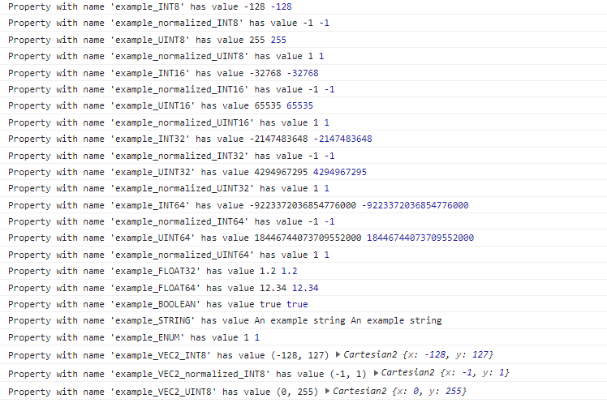

# Tileset with full Metadata

This sample demonstrates usage of the [`3DTILES_metadata`](https://github.com/CesiumGS/3d-tiles/tree/main/extensions/3DTILES_metadata) extension for storing metadata associated tileset.



<sup>This tileset does not have any visual elements. The above screenshot is symbolic for the output on the console.</sup>

The example contains metadata for the tileset, containing all possible property types:

- Single properties with integral component types `UINT8`, `INT8`, `UINT16`, `INT16`, `UINT32`, `INT32`, `UINT64`, `INT64`
- Single properties with component types `FLOAT32`, `FLOAT64`, `BOOLEAN`, `STRING`, and `ENUM`
- Compound types: `VEC2`, `VEC3`, `VEC4`, `MAT2`, `MAT3`, `MAT4`, with all numeric component types 
- Arrays with all component types, once with fixed length and once with dynamic length
- All integer component types are once used in normalized and once in non-normalized form

The following sandcastle iterates over all properties of this tileset, and prints the property values:

```
// Enable the experimental model features for metadata support
Cesium.ExperimentalFeatures.enableModelExperimental = true;

var viewer = new Cesium.Viewer('cesiumContainer');

// Load the tileset from a local server
var tileset = viewer.scene.primitives.add(new Cesium.Cesium3DTileset({
    url : 'http://localhost:8003/TilesetWithFullSchema.json',
}));

// Wait until the tileset and its associated metadata are loaded
tileset.readyPromise.then(function() {
  
  // The Cesium3DTilesetMetadata stores the metadata results
  var cesium3DTilesetMetadata = tileset.metadata;
  
  // The metadata entity is the instance that has been created
  // from the metadata values, conforming to the schema
  var tilesetMetadataEntity = cesium3DTilesetMetadata.tileset;
  
  // Examine the MetadataSchema 
  var metadataSchema = cesium3DTilesetMetadata.schema;
  
  // Iterate over all classes of the schema
  var classes = metadataSchema.classes;
  for (var metadataClassId in classes) {
    if (classes.hasOwnProperty(metadataClassId)) {
      var metadataClass = classes[metadataClassId];
      
      // Iterate over all properties of the class
      var properties = metadataClass.properties;
      for (var metadataClassPropertyId in properties) {
        if (properties.hasOwnProperty(metadataClassPropertyId)) {

          // Obtain the value of each property from the
          // metadata entity, and print it to the console
          var value = tilesetMetadataEntity.getProperty(metadataClassPropertyId);
          console.log("Property with name '" + metadataClassPropertyId + "'" +
                      "has value " + value, value);
        }
      }
    }
  }
  
});
```

