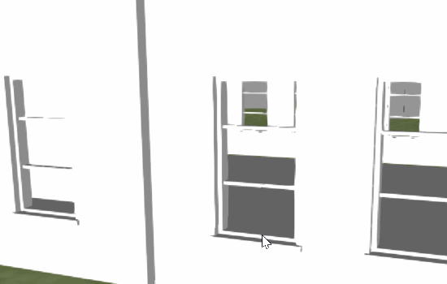

# Tileset with request volume
## Description
The tileset shows off the `requestVolume` property of a tile. When the viewer is inside the request volume of the point cloud, the point cloud is rendered.
In addition this sample illustrates loading an external tileset from within the main `tileset.json`.

## Screenshot

## License

[Creative Commons Attribution 3.0 Unported](https://creativecommons.org/licenses/by/3.0/)

The building model was created by Richard Edwards: http://www.blendswap.com/blends/view/45211
